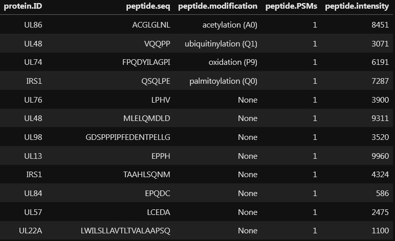

# Proteogenome
## A software for the visualization of proteomics data

### **TABLE OF CONTENTS**
[Introduction](#i) </br>
[What Proteogenome Does](#wpd) </br>
[How Proteogenome Works](#hpw) </br>
- [Protein Map](#hpwpm)
- [Peptide Map](#hpwpepm)
- [PTM Map](#hpwptmm)
- [The Allowed Genomic Space](#hpwags)

[Proteogenome Input Files](#pif) </br>
[The Protein Map](#tpm) </br>
[Map Peptides and PTM With PoGo](#mppwp)
- [PoGo Input Files](#pgif)
- [Tags for The Genomic Linkage](#mpptmpgtgl)
- [Use PoGo](#upg)
- [PoGo Output Overview](#pgoo)

[The Peptide Map](#tpepm) </br>
[The PTM Map](#tptmm) </br>
[Visualise The Maps](#vtm) </br>
[References](#r) </br>

[Appendix](#appendix) </br>
  
<a name="i"/></a></br>
### ***Introduction***
This software has been developed considering the mass spectrometry (MS) analysis process. In general, the mass spectrometers generate peptide raw data. If not further processed, these data are not very informative. For this reason, onboard the mass spectrometer appliances, specific software are often available. These tools perform the data analysis allowing the peptide sequences identification, if present where occur the post transitional modifications (PTM) in the peptide sequence and the proteins identification (providing the ID codes) from which the peptides come. Our purpose is to represent these data on a genome browser giving the opportunity to have an overview of three main feature of these proteomics data:
- which parts of the DNA are expressed (protein map) 
- how intese has been this expression (protein map color coding)
- which peptides confirm the presence of a protein and where they are located (peptide map)
- if present, where post transitional modifications occour in the peptide sequences (PTM map)

<a name="wpd"/></a></br>
### ***What Proteogenome does***
Proteogenome is a Python module created for viewing proteomic data. These data must be represented by the MS\MS peptides together with their intensity and the ID numbers of the proteins from which they were generated.

The Proteogenome output will be the protein and the peptide map in BED file format. Proteogenome has been developed using IGV 2.12.2 to visualise the map. Based on the layout of this software, on the top will be visualised the reference genome of a specific organism, while below it will be visualised the peptide and the protein map. In particular, the protein map will report the protein expression level detected in the specific proteome. This representation will be similar to a heatmap of protein intensities.

<a name="hpw"/></a></br>
### ***How Proteogenome Works***
The activity to map the peptides on a reference genome is similar to reversing the Central Dogma of Molecular Biology moving from the polypeptide chain to the DNA sequence made of nucleotides.
Proteogenome performs a proteomic map where proteins and peptides are graphically located against the DNA strand from wich they have been translated. This is possible only if we can find the genomic coordinates of each amino acid. In other words, we need a genomic linkage between each protein sequence and the DNA sequence. 
This linkage will be represented by the genomic annotations of the proteins that we are trying to map. Therefore, **it is necessary that each protein identified by the MS analysis has been also annotated in the reference genome used in the mapping operation**.

<a name="hpwpm"/></a></br>
**Protein Map Overview** </br>
For the protein map the software will consider the protein codes provided by the MS analysis. These codes must be UniProt accession codes. Once collected these codes, Proteogenome will refer to the protein genomic annotations (in GFF3 format) to fetch the genomic coordinates. In particular, it will consider the genomic coordinates of all the the DNA coding sequences that make up each protein (only the CDS annotations).The final map will be a .bed track suitable for the IGV genome browser. The .bed format store the RGB code in the column 9. Proteogenome will consider the protein expression level in order to assign an RGB code according to a color gradient. The protein expression level will be obtained adding the intensity of all the peptides that belong to the specific protein.

<a name="hpwpepm"/></a></br>
**Peptide Map Overview** </br>
Peptides are protein fragments of different sizes. For this reason, it is not possible to refer only to the protein genomic annotations in order to fetch the peptide genomic coordinates. There are two reasons why annotations cannot be used to map the peptide directly:

- Firstly, if we consider an annotated genome, we can find different types of annotations. As described for the protein map, Proteogenome will only refer to CDS (coding regions). However, peptides are just protein fragments. Due to the genetic code, each position in the protein sequence will be represented by a three nucleotide codon in the DNA. Therefore, the genomic coordinates provided in the CDS annotations cannot be used as they are to represent a single peptide. 

- Secondly, the protein sequences are obtained by combining several CDS blocks. This mechanism, called alternative splicing, increases the complexity of the task to identify the peptide genomic coordinates. Indeed, while a protein sequence could be represented as a contiguous series of amino acids, the set of CDS that make up this sequence could come from DNA regions sometimes very far away from each other. This means that from protein back to the genome, the amino acids' contiguous order would be no longer maintained in the genome coordinates. As a result, one peptide could map a protein region that has been generated from a DNA splicing event. In this case, the peptide sequence would have been generated considering two CDS blocks. In the final peptide map, this case must be represented by spliced peptides where each peptide fragment matches the CDS from which it comes. 

These two aspects suggest that the peptide map is based on two main steps: 
1. Fetching the **in protein coordinates**: align the peptide sequence to the protein sequence in order to find the position of the peptide in the protein sequence.
2. Fetching the **in genome coordinates**: consider all the CDS involved in the protein sequence and convert the in protein coordinates into genomic coordinates using the CDS genomic annotations and the codon constrain.

To accomplish this task we have choose the [PoGo](https://github.com/cschlaffner/PoGo) software.  

<a name="hpwptmm"/></a></br>
**PTM Map** </br>
PoGo can map also the PTMs that eventually occur on a peptide sequence. However, for the PTMs, it generates a separated .bed track where any type of post-transitional modification is highlighted with a colour code.   

 

PTM colour code table from https://github.com/cschlaffner/PoGo

<a name="hpwags"/></a></br>
**The Allowed Genomic Space** </br>
It is important to note that the user can visualise the peptide and PTM maps just after they have been generated by PoGo. Nevertheless, PoGo maps the peptides considering the entire reference genome. Conversely, Proteogenome is created to allow the user to focus only on the proteins that have been identified in the MS analysis. This implies that the collection of all the CDS that are involved in the translation of all the proteins identified in the proteomics data will define an allowed genomic space. As a consequence, everything that maps outside this space will be not part of the final maps. Because Proteogenome relies on the input proteomics data, it can filter the peptide map and the PTM map accordingly to the allowed genomic space.


### NOTES

All the sample data (Data folder in this repository), examples and figures are related to the [HCMV strain Merlin](https://www.ncbi.nlm.nih.gov/nuccore/155573622)


<a name="pif"/></a></br>
### ***Proteogenome Input Files*** 
In order to run Proteogenome and visualise the tracks generated by this software, you need at least 4 files.

### To run Proteogenome
| TYPE  | CONTENT |
| ----  | ---- |
| FASTA | [protein sequences (amino acids)](#pifps) |
| GFF3  | [protein annotations](#pifpa) |
| TXT   | [proteomics data](#pifpd) |

### To visualise the map
| TYPE  | CONTENT |
| ----  | ---- |
| FASTA | [reference genome of the specific organism (nucleotides)](#pifrg) |

<a name="pifps"/></a></br>
### FASTA - protein sequences (amino acids)
This file must contains the protein sequences of the specific organism.
The recommended format for this file should be like this :
```sh
>NC_006273.2_prot_YP_081455.1_1 gene=RL1 gene:gene-HHV5wtgp001 transcript:rna-HHV5wtgp001 db_xref=GeneID:3077430 protein=proteinRL1 protein_id=YP_081455.1 location=1367..2299 gbkey=CDS
MPATDTNSTHTTPLHPEDQHTLPLHHSTTQPHVQTSDKHADKQHRTQMELDAADYAACAQARQHLYGQTQPQLHAYPNANPQESAHFRTENQHQLTNLLHNIGEGAALGYPVPRAEIRRGGGDWADSASDFDADCWCMWGRFGTMGRQPVVTLLLARQRDGLADWNVVRCRGTGFRAHDSEDGVSVWRQHLVFLLGGHGRRVQLERPSAGEAQARGLLPRIRITPISTSPRPKPPQPTTSTASHPHATARPDHTLFPVPSTPSATVHNPRNYAVQLHAETTRTWRWARRGERGAWMPAETFTCPKDKRPW
```
This FASTA file must report the amino acids sequences. It will be used  to align the peptide sequences.

<a name="pifpa"/></a></br>
### GFF3 - protein annotations
This file must contains the protein annotations of the specific organism.
The recommended format for this file should be like this :
```sh
NC_006273.2	RefSeq	exon	1356	2386	.	+	.	ID=exon-HHV5wtgp001-1;Parent=rna-HHV5wtgp001;Dbxref=GeneID:3077430;experiment=Northern blot,RACE;gbkey=mRNA;gene=RL1;locus_tag=HHV5wtgp001;product=protein RL1
```
<a name="pifpd"/></a></br>
### TXT - proteomics data
Proteogenome can read proteomic data provided in CSV or TSV file. The table must contain the following data:

- **Protein Accession** - UniProt protein accession codes

- **Peptide Sequence** - Amino Acids

- **Peptide Modification** - The type and the position of the PTM inside the peptide.
    For instance, considering the line '3535' in the example table below. The Carbamidomethyl C(9) notation means that the PTM occours on the Cysteine at position 9 in this specific peptide. 

- **Peptide PSMs** - Number of peptide-spectrum matches (PSMs) for the given peptide, if available from the MS/MS analysis.

- **Peptide Intensity** - Peptide intensity, from the MS/MS analysis. 


Example Table:


The peptides table must include all the 5 columns.
The value in the Peptide PSMs column must be at least 1 for each peptide (not 0). 

<a name="pifrg"/></a></br>
### FASTA refernce genome (nucleotides)
This additional FASTA file is not required by Proteogenome. It must contains the reference genome and should be required for map visualisation in the genome browser. 
The recommended format for this file should be like this :

```sh
>NC_006273.2 Human herpesvirus 5 strain Merlin, complete genome
CCATTCCGGGCCGTGTGCTGGGTCCCCGAGGGGCGGGGGGGTGTTTTCTGCGGGGGGGTGAAATTTGGAGTTGCGTGTGTGGACGGCGACGGCGACTAGTTGCGTGTGCTGCGGTGGGTACGGCGACGGCGAATAAAAGCGACGTGCGGCGCGCACGGCGAAAAGCAGACGCGCGTCTGTGTCTGTTTGAGTCCCCAGGGGACGGCAGCGCGGGTCCTTGGGGACACACGCAAAACAACGGCCAGACAAGACGCGGGCGCAAGGGAGGAGTCGCGGGCCCCGGGGCACACTGCACAACCCGCGTCGAGGACACACGCAGACACGGCCCGCCAACACACCCCGACACACCCCTGACACACCCCGCCGACACACCCGGCACACGCCCGCGACACACCCGGCCAACACACCCCGACACACCCGGCACACGCCCGCGACACACCCGGCCAACACACCCCGACACACCCGGCACACGCCCGCGACACACCCGCGGCACACCCTGACACACCCGCCACACCCGGCACACACCCACCCCGCCGCGCCCCCGACACACCCCGACCGCCGCCGGTGCGGGACAGGGCTAAGCGCCTTTATGGCGCCGCAAGCGCTCCGCCGCTTCTGCGGCTTGCTGTC
```
---------------------------------------------------------------------------------------------------

<a name="tpm"/></a></br>
## ***The Protein Map*** 

#### 1. Create an instance of type *Organism*
```sh
my_Organism=Pg.Organism(FASTA_filename='HCMV_CodingSeq.fasta',
                        annot_filename='HCMV_Protein_Annotations.gff3',
                        input_table_filename='peptide_table.txt')
```

#### 2. Initialise the index tables
```sh
my_Organism.initialise_indexes()
```

#### 3. Generate the protein map
```sh
my_Organism.protein_track(bed_fn='Protein.bed')
```
---------------------------------------------------------------------------------------------------

<a name="mppwp"/></a></br>
### ***Map Peptides and PTM With PoGo***
Pogo is a peptides mapping tool developed by [Schlaffner et all.](#ref1).      

<a name="pgif"/></a></br>
***PoGo Input Files*** </br>
| TYPE  | CONTENT |
| ----  | ---- |
| EXE   | [executable version of PoGo software](#mpptmpgev) |
| FASTA | [reference genome of the specific organism (nucleotides)](#pifrg) |
| GTF   | [protein annotations](#mpptmpgpa) |
| TXT   | [peptide table formatted for PoGo usage](#mpptmpgpt) |
 
<a name="mpptmpgev"/></a></br>
**EXE - executable version of PoGo** </br>
In the PoGo repository is possible to download the [zip folders](https://github.com/cschlaffner/PoGo/releases) with source code and different versions of the software suitable for Windows, Mac and Linux. In the Proteogenome PoGo/ folder we have included the three executable versions of PoGo and the .jar user interface.

<a name="mpptmpgpa"/></a></br>
**GTF - protein annotations** </br>
PoGo works with the protein genomic annotations in GTF format. In the case of annotations in other formats, it will be necessary to convert the file in GTF.
For instance, the annotations provided with Proteogenome are in GFF3 format and have been converted in GTF using [AGAT](https://github.com/NBISweden/AGAT). 

<a name="mpptmpgpt"/></a></br>
**TXT - peptide table formatted for PoGo usage** </br>
PoGo can process input peptides data organized with this format: 

| DATA              | DESCRIPTION |
| ----------------- | ----------------- |
| Experiment Tag    | The code or identifier that refers to source of data. |
| Peptide Sequence  | The sequence of amino acid that make up the peptide (in capital letters) |
| PSM               | Number of peptide-spectrum matches (PSMs) for the given peptide, if available from the MS/MS analysis. If not provided this value can be set to 1 (not 0) |
| Peptide Intensity | Peptide intensity, from the MS/MS analysis. |

Aside from the 'Experiment Tag' field, all the other data are a subset of the input [proteomics data](#pifpd) file that is processed by Proteogenome. The peptide table must be a tab separated file. 

<a name="mpptmpgtgl"/></a></br>
***Tags for The Genomic Linkage*** </br>
As stated in the [Peptide Map Overview](#hpwpepm) the possibility to map amino acids on the the DNA sequence is enabled by the genomic linkage. The main steps that generate this connection are the alignment with the protein sequence and subsequently the retriving of genomic coordinates on the annotations. Therefore, the file involved in the linkage are the [FASTA](#pifrg) protein sequences and the [GTF](#mpptmpgpa) protein annotations. However, PoGo looks for specific tags in each of these file formats. These tags are:
  | FORMAT | RELEVANT TAGS     | VALUES EXAMPLES                        |
  | ------ | ------            | ------                                 |
  | FASTA  | **gene**          | **gene:** *HHV5wtgp001*                |
  | FASTA  | **transcript**    | **transcript:** *HHV5wtgp001*          |  
  | GTF    | **gene_id**       | **gene_id** *"gene-HHV5wtgp001";*      |
  | GTF    | **transcript_id** | **transcript_id** *"rna-HHV5wtgp001";* |

PoGo can connect the FASTA alignmente to the genomic coordinates in the GTF annotations only if the tag values in FASTA and GTF are **unique**.

However, these values are not guaranteed to be unique. For this reason, Proteogenome provides the functions that allow to manipulate the file formats. For an example of use see [Appendix](#appendix).

---------------------------------------------------------------------------------------------------


<a name="wtsd"/></a></br>
## ***Visulise the Map*** 
#### 1. Upload the reference genome
This track is the genome of the species from which the proteomics data come from. In order to add the reference genome select **Genomes** - **Load Genome from File** and select your FASTA file for the reference genome.
If you are using the data provided by this repository then load the file ***HCMV_CompleteRecord.fasta***


#### 2. Upload gene annotations for the reference genome
For the gene annotations track for the reference genome, select ***File*** - ***Load from File*** and select the GFF3 file with the annotations.
If you are using the data provided by this repository then load the file ***HCMV_Protein_Annotations.gff3***


#### 3. Upload the peptide map
Use the same menu options ***File*** - ***Load from File***

#### 4. Upload the protein map
Use the same menu option ***File*** - ***Load from File***

---------------------------------------------------------------------------------------------------
<a name="r"/></a></br>
## ***References***

<a name="ref1"/></a></br>
1. [Schlaffner, C., Pirklbauer, G.,  Bender, A. (2017). Fast, Quantitative and Variant Enabled Mapping of Peptides to Genomes. Cell Systems 5: 152–156](https://www.ncbi.nlm.nih.gov/pmc/articles/PMC5571441/)

---------------------------------------------------------------------------------------------------

<a name="appendix"/></a></br>
## ***Appendix***

The purpose of this example is to present some formats issues that could affect the GTF and FASTA files and suggest how to manage them using Proteogenome.

This example has been developed using the annotation file (GFF3) and the FASTA sequence file provided in the Data/ folder of this repository. However, other annotation and FASTA files could present formats not compliant with PoGo that are completely different from what will be presented in this example. 

After the conversion of the GFF3 file in GTF format, it is recomended to check the tags and their values.
For this purpose use the method **.print_lst()**. 
If the user finds a format issue, there are two methos that can help to fix them: **.rectify_rows()** - **.locus_tag_substitution()** - **.FASTA_cpt_seq**

### FASTA

#### 1. Inspect the FASTA  
After the initialisation of the HCMV instance, the **HCMV.FASTA_lst** will be the attribute that stores the FASTA headers and sequences in a list. As mentioned in the [Tags for The Genomic Linkage](#mpptmpgtgl), in the FASTA, the relevant tags to inspect are **gene** and **transcript**.

```sh
HCMV.print_lst(HCMV.FASTA_lst, limit=6)
```


```sh
>lcl|NC_006273.2_prot_YP_081455.1_1 [gene=RL1] [locus_tag=HHV5wtgp001] [db_xref=GeneID:3077430] [protein=protein RL1] [protein_id=YP_081455.1] [location=1367..2299] [gbkey=CDS]
----------------------------------------------------------------------------------------------------
MPATDTNSTHTTPLHPEDQHTLPLHHSTTQPHVQTSDKHADKQHRTQMELDAADYAACAQARQHLYGQTQ
----------------------------------------------------------------------------------------------------
PQLHAYPNANPQESAHFRTENQHQLTNLLHNIGEGAALGYPVPRAEIRRGGGDWADSASDFDADCWCMWG
----------------------------------------------------------------------------------------------------
RFGTMGRQPVVTLLLARQRDGLADWNVVRCRGTGFRAHDSEDGVSVWRQHLVFLLGGHGRRVQLERPSAG
----------------------------------------------------------------------------------------------------
EAQARGLLPRIRITPISTSPRPKPPQPTTSTASHPHATARPDHTLFPVPSTPSATVHNPRNYAVQLHAET
----------------------------------------------------------------------------------------------------
TRTWRWARRGERGAWMPAETFTCPKDKRPW
----------------------------------------------------------------------------------------------------
```

The output reveals several problems :
- The headers lack of the relevant tags **gene** and **transcript**. This issue will avoid the right mapping between the FASTA alignment and the GTF annotations
- The protein sequence is splitted in different rows. This will prevent that PoGo align the peptides over the entire protein sequence. here are square brackets that must be removed. Moreover, from a previous understanding of the sequence ontology of the HCMV, it would be necessary rely on the locus_tag value as valid protein ID. However, the header lacks of the relevant tags **gene** and **transcript**. Therefore, in this particular case the best strategy is to remove the "locus_tag" tag and use its value (***HHV5wtgp001***) to insert the **gene** and **transcript** tags.

#### 2. Rectify FASTA headers - Remove Undesired Characters 
The first method to use for fixing the errors present in this example is **.rectify_rows()**:
```sh
HCMV.FASTA_lst=HCMV.rectify_rows(HCMV.FASTA_lst,target_sub_str=[('lcl|NC_006273.2_prot_',''),
                                                                ('[',''),
                                                                (']',''),
                                )
```
The "**target_sub_str**" parameter receives a list of tuples where the first element is a substring that must be replaced with the second element of the tuple. The meaning of these substitution tuples is as follows:
- **('lcl|NC_006273.2_prot_','')** - means remove the substring *lcl|NC_006273.2_prot_*. We decided to remove this NCBI identifier to simplify the header parsing.
- **('[','')  -  (']','')** - means remove the square brachets. These characters are not compliant with the PoGo parser. 

```sh
HCMV.print_lst(HCMV.FASTA_lst, limit=6)
```

```sh
>YP_081455.1_1 gene=RL1 locus_tag=HHV5wtgp001 db_xref=GeneID:3077430 protein=protein RL1 protein_id=YP_081455.1 location=1367:2299 gbkey=CDS
----------------------------------------------------------------------------------------------------
MPATDTNSTHTTPLHPEDQHTLPLHHSTTQPHVQTSDKHADKQHRTQMELDAADYAACAQARQHLYGQTQ
----------------------------------------------------------------------------------------------------
PQLHAYPNANPQESAHFRTENQHQLTNLLHNIGEGAALGYPVPRAEIRRGGGDWADSASDFDADCWCMWG
----------------------------------------------------------------------------------------------------
RFGTMGRQPVVTLLLARQRDGLADWNVVRCRGTGFRAHDSEDGVSVWRQHLVFLLGGHGRRVQLERPSAG
----------------------------------------------------------------------------------------------------
EAQARGLLPRIRITPISTSPRPKPPQPTTSTASHPHATARPDHTLFPVPSTPSATVHNPRNYAVQLHAET
----------------------------------------------------------------------------------------------------
TRTWRWARRGERGAWMPAETFTCPKDKRPW
----------------------------------------------------------------------------------------------------
```

#### 3. Rectify FASTA headers - Insert Relevant Tags
Because the header lacks of the relevant tags **gene** and **transcript**, it is necessary apply the method **.locus_tag_substitution()**.

```sh
HCMV.FASTA_lst=HCMV.locus_tag_substitution(HCMV.FASTA_lst)
```

This method remove the "locus_tag" and uses its value to generate the "gene" and "transcript" tags. 

```sh
HCMV.print_lst(HCMV.FASTA_lst, limit=6)
```

```sh
>YP_081455.1_1 gene=RL1 gene:HHV5wtgp001 transcript:HHV5wtgp001 db_xref=GeneID:3077430 protein=protein RL1 protein_id=YP_081455.1 location=1367:2299 gbkey=CDS
----------------------------------------------------------------------------------------------------
MPATDTNSTHTTPLHPEDQHTLPLHHSTTQPHVQTSDKHADKQHRTQMELDAADYAACAQARQHLYGQTQ
----------------------------------------------------------------------------------------------------
PQLHAYPNANPQESAHFRTENQHQLTNLLHNIGEGAALGYPVPRAEIRRGGGDWADSASDFDADCWCMWG
----------------------------------------------------------------------------------------------------
RFGTMGRQPVVTLLLARQRDGLADWNVVRCRGTGFRAHDSEDGVSVWRQHLVFLLGGHGRRVQLERPSAG
----------------------------------------------------------------------------------------------------
EAQARGLLPRIRITPISTSPRPKPPQPTTSTASHPHATARPDHTLFPVPSTPSATVHNPRNYAVQLHAET
----------------------------------------------------------------------------------------------------
TRTWRWARRGERGAWMPAETFTCPKDKRPW
----------------------------------------------------------------------------------------------------
```

#### 4. Rectify FASTA headers - Remove Substring with Variable Parts
At this point the issue is represented by the tag "***gene=RL1***". This tag could generate a conflict with the desired tag "gene:HHV5wtgp001" because both of them are "**gene**". However, this time the substring that we want to remove from the header is composed by two parts. One part is fixed ("gene="), while the second one is variable (in this protein header the id is "RL1", but this id changes over the protein set). For this reason, we need to pass another parameter to the method .rectify_rows(). With **target_patterns**, it is possible to provide a list of tuples where the pattern in the first position is substituted by a constant string in the second position of the tuple.

```sh
HCMV.FASTA_lst=HCMV.rectify_rows(HCMV.FASTA_lst, target_patterns=[('gene=.*?\s','')])
```

```sh
HCMV.print_lst(HCMV.FASTA_lst, limit=6)
```

```sh
>YP_081455.1_1 gene:HHV5wtgp001 transcript:HHV5wtgp001 db_xref=GeneID:3077430 protein=protein RL1 protein_id=YP_081455.1 location=1367:2299 gbkey=CDS
----------------------------------------------------------------------------------------------------
MPATDTNSTHTTPLHPEDQHTLPLHHSTTQPHVQTSDKHADKQHRTQMELDAADYAACAQARQHLYGQTQ
----------------------------------------------------------------------------------------------------
PQLHAYPNANPQESAHFRTENQHQLTNLLHNIGEGAALGYPVPRAEIRRGGGDWADSASDFDADCWCMWG
----------------------------------------------------------------------------------------------------
RFGTMGRQPVVTLLLARQRDGLADWNVVRCRGTGFRAHDSEDGVSVWRQHLVFLLGGHGRRVQLERPSAG
----------------------------------------------------------------------------------------------------
EAQARGLLPRIRITPISTSPRPKPPQPTTSTASHPHATARPDHTLFPVPSTPSATVHNPRNYAVQLHAET
----------------------------------------------------------------------------------------------------
TRTWRWARRGERGAWMPAETFTCPKDKRPW
----------------------------------------------------------------------------------------------------
```

#### 5. Rectify FASTA headers - Compact the Sequences
The last issue is related to the fact that the output of the method .print_lst() is printing the protein sequence splitted by dashed lines. This means that the protein sequence is not a unique straight line. The method to use in this case is **.FASTA_cpt_seq()**.

```sh
HCMV.FASTA_lst=HCMV.FASTA_cpt_seq(HCMV.FASTA_lst)
```

```sh
HCMV.print_lst(HCMV.FASTA_lst, limit=6)
```

```sh
>YP_081455.1_1 gene=RL1 gene:HHV5wtgp001 transcript:HHV5wtgp001 db_xref=GeneID:3077430 protein=protein RL1 protein_id=YP_081455.1 location=1367:2299 gbkey=CDS
----------------------------------------------------------------------------------------------------
MPATDTNSTHTTPLHPEDQHTLPLHHSTTQPHVQTSDKHADKQHRTQMELDAADYAACAQARQHLYGQTQPQLHAYPNANPQESAHFRTENQHQLTNLLHNIGEGAALGYPVPRAEIRRGGGDWADSASDFDADCWCMWGRFGTMGRQPVVTLLLARQRDGLADWNVVRCRGTGFRAHDSEDGVSVWRQHLVFLLGGHGRRVQLERPSAGEAQARGLLPRIRITPISTSPRPKPPQPTTSTASHPHATARPDHTLFPVPSTPSATVHNPRNYAVQLHAETTRTWRWARRGERGAWMPAETFTCPKDKRPW
----------------------------------------------------------------------------------------------------
```

### GTF 

#### 1. Upload the GTF Annotations   
```sh
HCMV.annot_lst=HCMV.file_to_lst(home+'Data/PoGo_Input_Files/HCMV_Protein_Annotations.gtf')
```

In the instance HCMV it is already present the attribute **.annot_lst**. This attribute contain the GFF3 annotations provided at the initialisation of the instance. Nevertheles, for PoGo we need to use the GTF annotations. For this reason, we upload the GTF file in the .annot_lst attribute.


#### 2. Inspect the GTF
```sh
HCMV.print_lst(HCMV.annot_lst, limit=7)
```

```sh
##gtf-version 3
----------------------------------------------------------------------------------------------------
NC_006273.2 RefSeq  gene    1356    2386    .   +   .   gene_id "gene-HHV5wtgp001"; Dbxref "GeneID:3077430"; ID "gene-HHV5wtgp001"; Name "RL1"; gbkey "Gene"; gene "RL1"; gene_biotype "protein_coding"; locus_tag "HHV5wtgp001";
----------------------------------------------------------------------------------------------------
NC_006273.2 RefSeq  transcript  1356    2386    .   +   .   gene_id "gene-HHV5wtgp001"; transcript_id "rna-HHV5wtgp001"; Dbxref "GeneID:3077430"; ID "rna-HHV5wtgp001"; Parent "gene-HHV5wtgp001"; experiment "Northern blot" "RACE"; gbkey "mRNA"; gene "RL1"; locus_tag "HHV5wtgp001"; original_biotype "mrna"; product "protein RL1";
----------------------------------------------------------------------------------------------------
NC_006273.2 RefSeq  exon    1356    2386    .   +   .   gene_id "gene-HHV5wtgp001"; transcript_id "rna-HHV5wtgp001"; Dbxref "GeneID:3077430"; ID "exon-HHV5wtgp001-1"; Parent "rna-HHV5wtgp001"; experiment "Northern blot" "RACE"; gbkey "mRNA"; gene "RL1"; locus_tag "HHV5wtgp001"; product "protein RL1";
----------------------------------------------------------------------------------------------------
NC_006273.2 RefSeq  CDS 1367    2299    .   +   0   gene_id "gene-HHV5wtgp001"; transcript_id "rna-HHV5wtgp001"; Dbxref "Genbank:YP_081455.1" "GeneID:3077430"; ID "cds-YP_081455.1"; Name "YP_081455.1"; Note "RL1 family"; Parent "rna-HHV5wtgp001"; gbkey "CDS"; gene "RL1"; locus_tag "HHV5wtgp001"; product "protein RL1"; protein_id "YP_081455.1";
----------------------------------------------------------------------------------------------------
NC_006273.2 RefSeq  five_prime_utr  1356    1366    .   +   .   gene_id "gene-HHV5wtgp001"; transcript_id "rna-HHV5wtgp001"; Dbxref "GeneID:3077430"; ID "nbis-five_prime_utr-1"; Parent "rna-HHV5wtgp001"; experiment "Northern blot" "RACE"; gbkey "mRNA"; gene "RL1"; locus_tag "HHV5wtgp001"; original_biotype "five_prime_UTR"; product "protein RL1";
----------------------------------------------------------------------------------------------------
NC_006273.2 RefSeq  three_prime_utr 2300    2386    .   +   .   gene_id "gene-HHV5wtgp001"; transcript_id "rna-HHV5wtgp001"; Dbxref "GeneID:3077430"; ID "nbis-three_prime_utr-1"; Parent "rna-HHV5wtgp001"; experiment "Northern blot" "RACE"; gbkey "mRNA"; gene "RL1"; locus_tag "HHV5wtgp001"; original_biotype "three_prime_UTR"; product "protein RL1";
----------------------------------------------------------------------------------------------------
```

The first 7 rows of the GTF annotations represent the complete sequence ontology for the protein RL1. However, as described in the [Allowed Genomic Space](#hpwags) section, PoGo cannot map the CDS of this protein because the value of the relevant tags is not unique between FASTA and GTF. 
So far, we have set in the FASTA tags as **gene:** ***HHV5wtgp001*** **transcript:** ***HHV5wtgp001***. 
Instead, in the GTF we have **gene_id** "***gene-HHV5wtgp001***"; **transcript_id** "***rna-HHV5wtgp001***"
For the correct genomic linkage there are two substring to remove "**gene-**" and "**rna-**".

#### 3. Rectify GTF rows - Remove Undesired Substrings